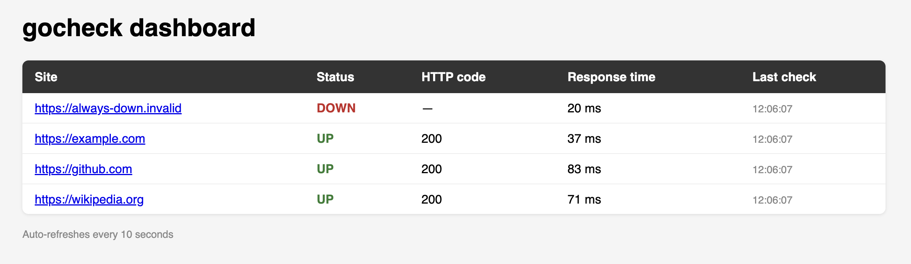

# gocheck

A small website uptime monitor with a web dashboard. No external dependencies —
Go standard library only.



## Features

- Monitors a list of URLs read from `sites.txt`
- One goroutine per site, polling concurrently
- Web dashboard showing current status of every site
- Zero third-party dependencies — stdlib only
- Single binary, no runtime, no database

## Install

```sh
git clone https://github.com/AstonMarty13/gocheck.git
cd gocheck
go build -o gocheck ./cmd
```

Requires Go — see `go.mod` for the minimum version.

## Usage

Create a `sites.txt` next to the binary, one URL per line:

```
https://example.com
https://github.com
https://news.ycombinator.com
```

Then run it:

```sh
./gocheck
```

The dashboard is available at http://localhost:8080.

## How it works

At startup, `gocheck` reads `sites.txt` and spawns one goroutine per URL. Each
goroutine issues an HTTP GET on its own interval and writes the outcome into a
shared status map guarded by a mutex. A small HTTP server on port 8080 reads
that map and renders the dashboard.

State is held in memory only — restarting the process resets history.

## Limitations

Deliberately minimal. There is no persistence, no alerting, and no
authentication on the dashboard. It is meant to run on a trusted network as a
lightweight at-a-glance check, not as a replacement for Prometheus or
Uptime Kuma.

## License

MIT

Three things before you commit it:

- The screenshot is the highest-value part. Run it against a few URLs, grab the dashboard, save as docs/screenshot.png. A README with an image reads as a finished project; without one it reads as a sketch. If you skip it, delete that line rather than leave a broken image.
- Check the run path — I assumed cmd/main.go means go build ./cmd. Adjust if your module layout differs.
- The Limitations section is intentional. Naming what a tool deliberately doesn't do — and namechecking Prometheus — signals you know the production landscape. That reads better to a senior interviewer than a feature list alone.
